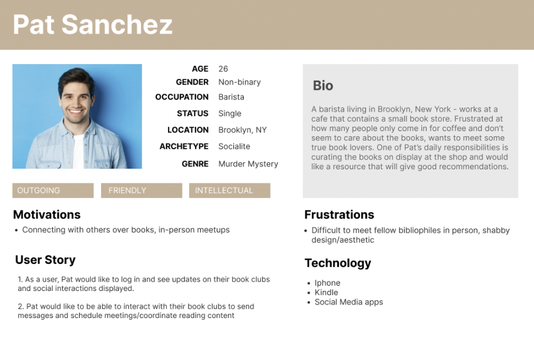
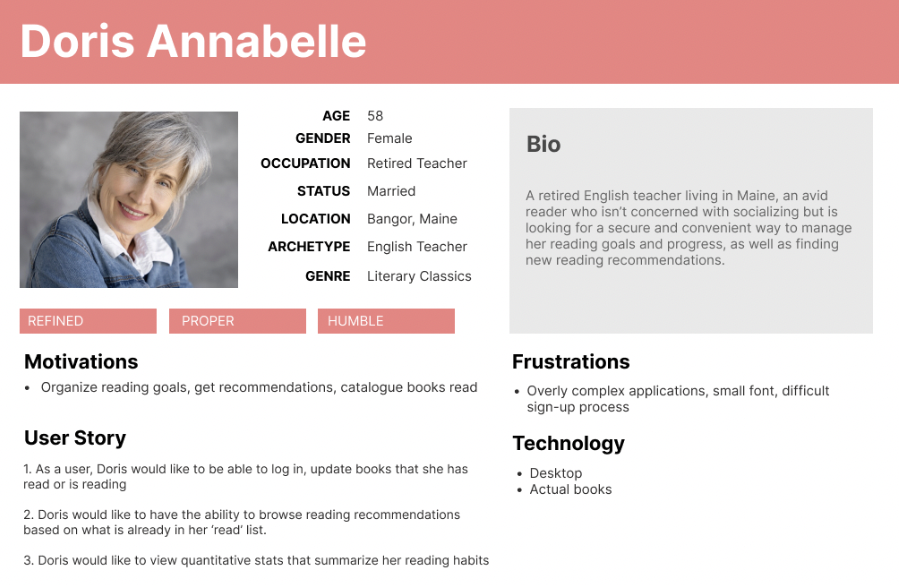
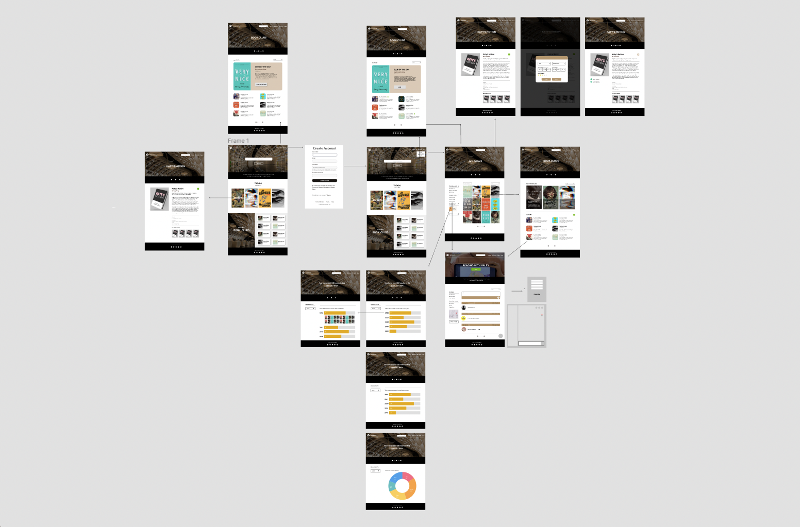
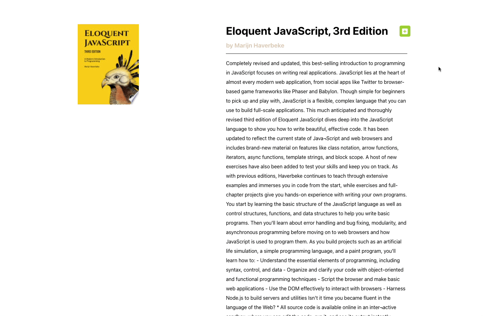
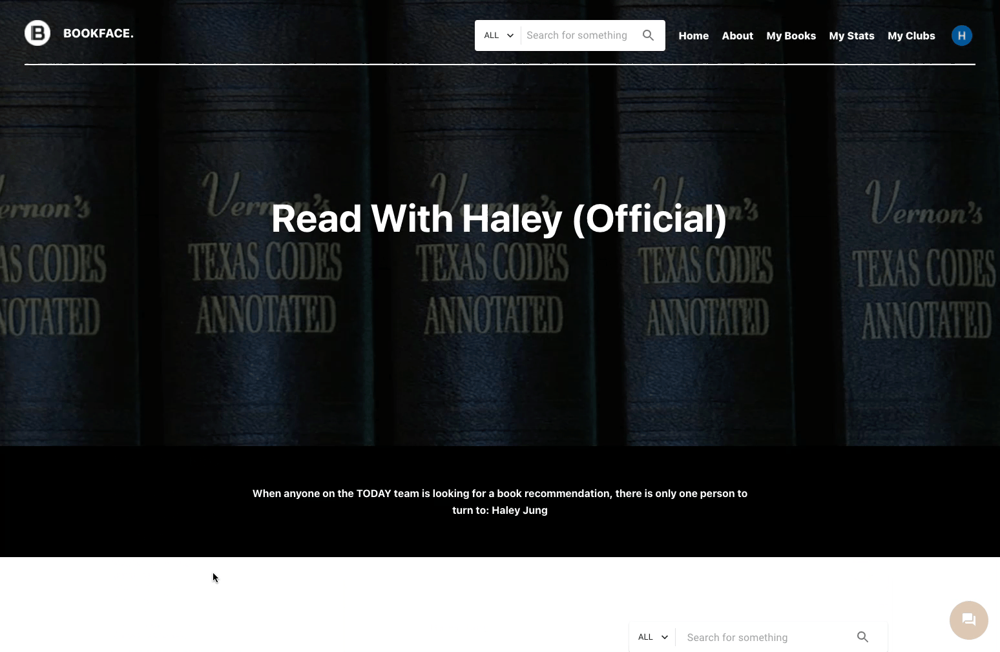
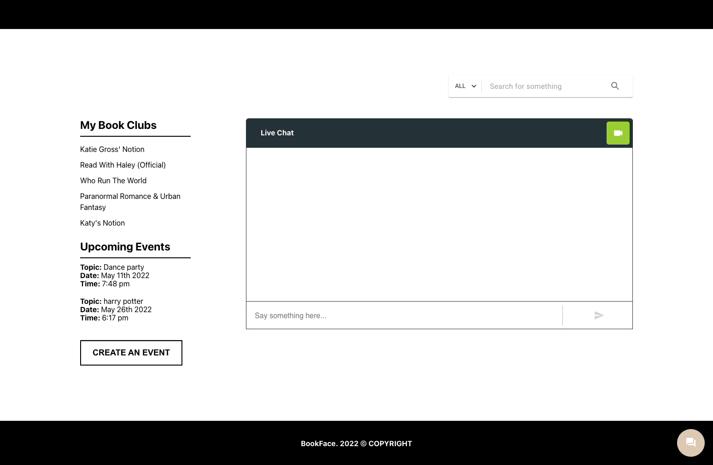

<div id="top"/>

# BookFace
BookFace is a social cataloging website that allows book lovers to connect, share books they love, and manage their collection of books with personalized bookshelves. This is the culmination of six engineers working closely over the course of one week to complete an MVP based on client's request.


## Table of Contents
- [BookFace](#bookface)
  - [Table of Contents](#table-of-contents)
  - [Tech Stack](#tech-stack)
  - [User Persona & Story](#user-persona--story)
  - [Wireframes](#wireframes)
  - [Product Features](#product-features)
    - [Home](#home)
    - [Login authentication with Firebase OAuth](#login-authentication-with-firebase-oauth)
    - [Live search with smart filter](#live-search-with-smart-filter)
    - [MyBooks](#mybooks)
    - [Book detail page](#book-detail-page)
    - [Reading Stats](#reading-stats)
    - [MyClubs](#myclubs)
    - [Club detail page](#club-detail-page)
    - [Live Chat](#live-chat)
    - [Video Chat](#video-chat)
  - [Getting Started](#getting-started)
    - [Installation](#installation)
  - [Contributors](#contributors)


## Tech Stack


## User Persona & Story



## Wireframes



## Product Features

### Home


### Login authentication with Firebase OAuth


### Live search with smart filter

> Users can perform sitewide search on books/bookclubs


### MyBooks

> Users can view their personalized bookshelves and joined bookclubs


### Book detail page
> Users can add book to their bookshelves and update reading status



### Reading Stats
> Users can generate a personalized reading statistics report


### MyClubs

> Users can explore and join bookclubs


### Club detail page

> Users can create an event and post messages



### Live Chat
> Users can chat with other club members



### Video Chat
> users can initiate a video call for club members to join


## Getting Started

### Installation

From the root directory, run the following commands in your terminal.

1. To install all dependencies

```
npm install
```

2. To start dev server: open http://localhost:3000 to view it in your browser

```
npm run dev
```

3. To build for production

```
npm run build
```

4. To locally preview production build
```
npm run preview
```

5. To connect to the server: use http://localhost:3030 to verify the server connection
```
npm run serve
```

6. To connect to socket for live chat
```
npm run socket
```

## Contributors

&nbsp;

<a href="https://github.com/MarianTLibrarian/BookFace/graphs/contributors">
  
</a>

&nbsp;

While all members worked as full stack engineers and had ownership of different features, we also took the following additional roles:

|   |  |
| ------------- | ------------- |
| Product Managers  | [Haley Jung](https://github.com/haleyjung) &  [Addison Hernandez](https://github.com/addisonhernandez)  |
| App Architects  | [Hailee Lu](https://github.com/HuijunLu) & [Katy Feng](https://github.com/katyfsy) |
| UI Leads  |[Junpeng Chang](https://github.com/jp-chang) & [Joseph Sanfelippo](https://github.com/JosephSanfelippo) |


<p align="right">(<a href="#top">back to top</a>)</p>
